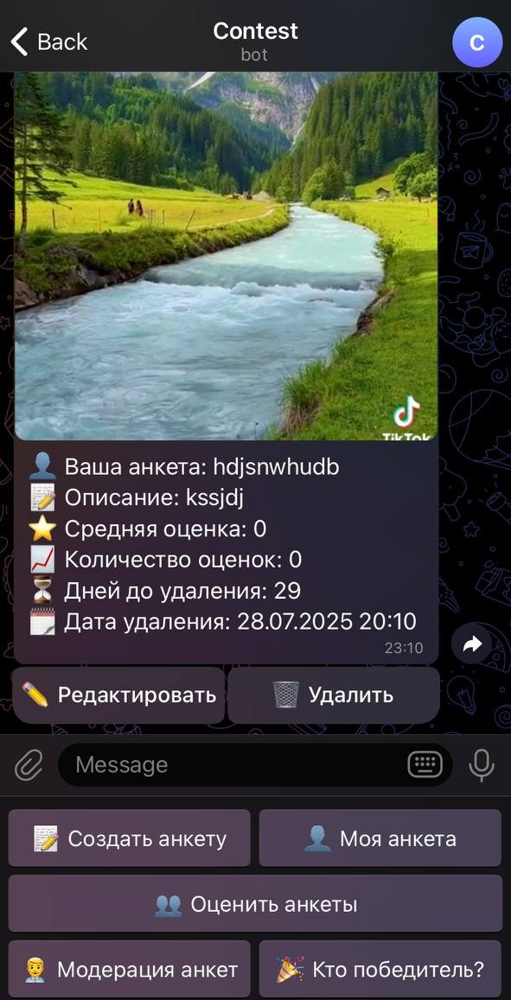
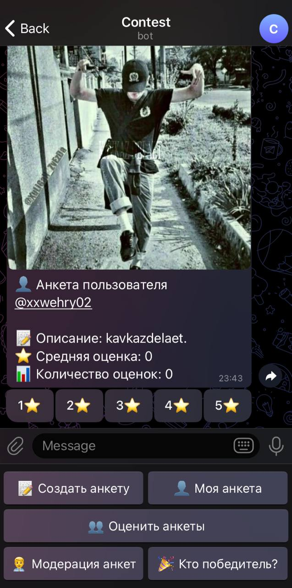

<!-- Improved compatibility of back to top link: See: https://github.com/othneildrew/Best-README-Template/pull/73 -->

<!--
*** Thanks for checking out the Best-README-Template. If you have a suggestion
*** that would make this better, please fork the repo and create a pull request
*** or simply open an issue with the tag "enhancement".
*** Don't forget to give the project a star!
*** Thanks again! Now go create something AMAZING! :D
-->

<!-- PROJECT SHIELDS -->
<!--
*** I'm using markdown "reference style" links for readability.
*** Reference links are enclosed in brackets [ ] instead of parentheses ( ).
*** See the bottom of this document for the declaration of the reference variables
*** for contributors-url, forks-url, etc. This is an optional, concise syntax you may use.
*** https://www.markdownguide.org/basic-syntax/#reference-style-links
-->

============================================================================================================================

  <h3 align="center">Телеграм бот с оцениванием анкет <b>с использованием БД</b></h3>

<!-- ABOUT THE PROJECT -->
# О чём проект

   
    
    

1️⃣ Этот Telegram-бот может быть предназначен для проведения масштабных конкурсов, челленджей, для организации знакомств, просмотра советов других людей и обмена опытом в различных сферах жизни 
2️⃣ Пользователи смогут не только делиться своими советами, идеями и достижениями, но и находить единомышленников, расширять круг общения и получать полезные рекомендации от других участников 
3️⃣ Труд не будет оставаться без внимания: каждую неделю в канал будет публиковаться победитель с наилучшей оценкой 
4️⃣ Бот обеспечивает удобную панель управления для пользователей и отдельную админ панель для модераторов с особым функционалом, а также автоматическую обработку голосов и результатов 
5️⃣ Он поможет вам легко управлять данными участников, просматривать их и подводить итоги 

# Принцип работы

## Для пользователей
* Пользователи создают собственную анкету, предоставляя рассказывая о том, чем гордишься, или делишься ценной рекомендацией
* После им открывается доступ к оценке других участников по 5-бальной шкале
* Другие пользователи смогут оценить твою анкету, а ты увидишь свой рейтинг и получишь шанс стать победителем недели
* Все данные сохраняются в реляционной базе данных для просмотра и анализа
  
## Для модераторов
* После заполнения каждой анкеты им приходит уведомление и даётся возможность одобрить/отклонить её
* Для удобства по кнопке они могут просматривать все анкеты для утверждения
* При помощи функционала админы могут сразу просматривать победителя в любой момент времени

<!-- GETTING STARTED -->
## Описание функционала основных кнопок
* <b>📝 Создать анкету</b>: Пользователь предоставляет описание и видео, после чего анкета отправляется на модерацию админу. До подтверждения он не может оценивать анкеты
* <b>👤 Моя анкета</b>: Показывает всю информацию об анкете пользователя: username, описание, видео, среднюю оценку, количество оценок, дату удаления и количество дней до удаления
* <b>👥 Оценить анкеты</b>: Даёт на оценку анкеты по 5-бальной шкале(оценить определённую анкету можно один раз)
* <b>👨‍💼 Модерация анкет</b>: Выдаёт новую панель с кнопками "📋 Анкеты на модерации" и "🔙 Назад"<b>(доступна только для модераторов)</b>
* <b>📋 Анкеты на модерации</b>: Выдаёт админу анкеты для утверждения<b>(доступна только для модераторов)</b>
* <b>🔙 Назад</b>: Возвращает в главное меню<b>(доступна только для модераторов)</b>
* <b>🎉 Кто победитель?</b>: Подсчитывает результаты и выдает пользователя с наилучшими показателями, то есть с наивысшей оценкой. При равенстве лучших оценок выдает победителя с наибольшим количеством голосов среди лидеров<b>(доступна только для модераторов)</b>
* <b>✅ Одобрить</b>: Одобряет анкету<b>(доступна только для модераторов)</b>
* <b>❌ Отклонить</b>: Отклоняет анкету<b>(доступна только для модераторов)</b>

<!-- MARKDOWN LINKS & IMAGES -->
<!-- https://www.markdownguide.org/basic-syntax/#reference-style-links -->
[contributors-shield]: https://img.shields.io/github/contributors/othneildrew/Best-README-Template.svg?style=for-the-badge
[contributors-url]: https://github.com/othneildrew/Best-README-Template/graphs/contributors
[forks-shield]: https://img.shields.io/github/forks/othneildrew/Best-README-Template.svg?style=for-the-badge
[forks-url]: https://github.com/othneildrew/Best-README-Template/network/members
[stars-shield]: https://img.shields.io/github/stars/othneildrew/Best-README-Template.svg?style=for-the-badge
[stars-url]: https://github.com/othneildrew/Best-README-Template/stargazers
[issues-shield]: https://img.shields.io/github/issues/othneildrew/Best-README-Template.svg?style=for-the-badge
[issues-url]: https://github.com/othneildrew/Best-README-Template/issues
[license-shield]: https://img.shields.io/github/license/othneildrew/Best-README-Template.svg?style=for-the-badge
[license-url]: https://github.com/othneildrew/Best-README-Template/blob/master/LICENSE.txt
[linkedin-shield]: https://img.shields.io/badge/-LinkedIn-black.svg?style=for-the-badge&logo=linkedin&colorB=555
[linkedin-url]: https://linkedin.com/in/othneildrew
[product-screenshot]: images/screenshot.png
[Next.js]: https://img.shields.io/badge/next.js-000000?style=for-the-badge&logo=nextdotjs&logoColor=white
[Next-url]: https://nextjs.org/
[React.js]: https://img.shields.io/badge/React-20232A?style=for-the-badge&logo=react&logoColor=61DAFB
[React-url]: https://reactjs.org/
[Vue.js]: https://img.shields.io/badge/Vue.js-35495E?style=for-the-badge&logo=vuedotjs&logoColor=4FC08D
[Vue-url]: https://vuejs.org/
[Angular.io]: https://img.shields.io/badge/Angular-DD0031?style=for-the-badge&logo=angular&logoColor=white
[Angular-url]: https://angular.io/
[Svelte.dev]: https://img.shields.io/badge/Svelte-4A4A55?style=for-the-badge&logo=svelte&logoColor=FF3E00
[Svelte-url]: https://svelte.dev/
[Laravel.com]: https://img.shields.io/badge/Laravel-FF2D20?style=for-the-badge&logo=laravel&logoColor=white
[Laravel-url]: https://laravel.com
[Bootstrap.com]: https://img.shields.io/badge/Bootstrap-563D7C?style=for-the-badge&logo=bootstrap&logoColor=white
[Bootstrap-url]: https://getbootstrap.com
[JQuery.com]: https://img.shields.io/badge/jQuery-0769AD?style=for-the-badge&logo=jquery&logoColor=white
[JQuery-url]: https://jquery.com 
